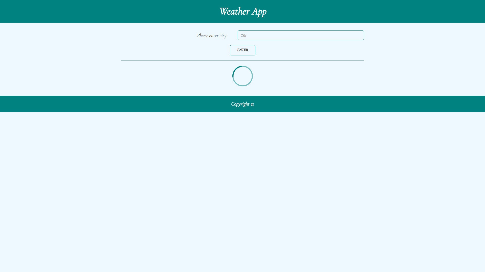
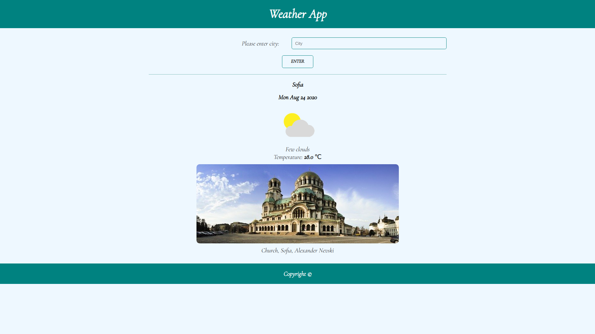
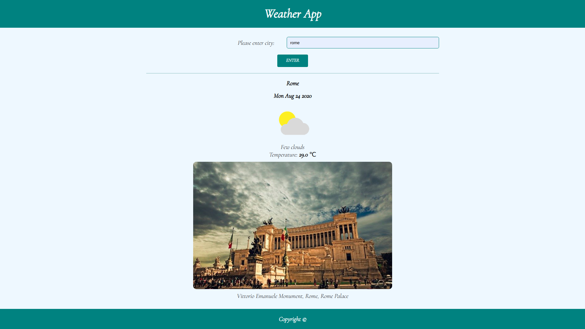

# WeatherApp

This project is based to connect to 5 diferents APIs and is build with React / React Components.

## Introduction

In this project are used:

- HTML
- CSS/SASS
- VanillaJS
- React
- NodeJS
- ExpressJS
- Webpack
- Service workers
- JestJS

### Getting started

To view and test the project need to download in .zip format or clone it repository.
The next step is to navigate (in the terminal) to the corresponding directory in which it is located and install depedencies with

```
npm install
```

For get user current location is used [Locations API](https://json.geoiplookup.io/).

For the result to be obtained there must be credentials for the APIS used in the project:

- **USERNAME** for [Geonames API](https://www.geonames.org/export/),
- **API_KEY** for [Weatherbit API](https://www.weatherbit.io/),
- **API_KEY** for [Pixabay API](https://pixabay.com/api/docs/),
- **API_KEY** for [Weather API](https://openweathermap.org/api).

They have saved in `.env` file with:

- GEO_USERNAME for Geonames API,
- WEATHERBIT_API_KEY for Weather API,
- PIXABAY_API_KEY for Pixabay API.
- OPENWEATHER_API_KEY for Weather API.

The next step is to execute the following commands:

- for development: before we go into development, we need to run production to create the dist folder

```
npm run build
npm run dev
```

- for production:

```
npm run build
```

and

```
serve -s build
```

In a new terminal tab in same directory run server with:

```
npm start
```

### Project run

After project is running, if user allow to browser to get location, data (for weather and picture of city) will be loaded without the user entered data.

---

### Screenshots

---

<div align="center">

#### Homepage (Loading data with current user ip address)



---

#### Homepage (Load data from current user ip address)



---

##### Result of search



</div>
